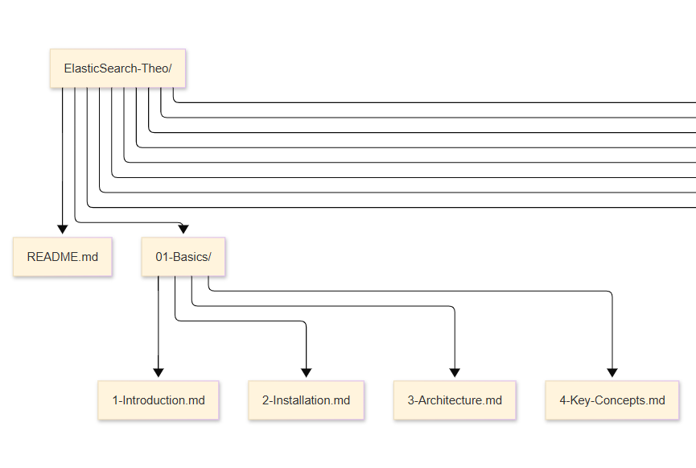

# ElasticSearch & Kibana Mastery 

A comprehensive, structured learning path and knowledge repository for mastering the Elastic Stack (Elasticsearch, Kibana, Beats, Logstash). This repo documents my journey from fundamental concepts to advanced implementation, complete with hands-on examples, configurations, and real-world use cases.


## 📖 Introduction

The Elastic Stack is a powerful collection of open-source tools for data ingestion, storage, search, analysis, and visualization. This repository serves as my personal knowledge base and a public portfolio to showcase my expertise in:

*   **Elasticsearch:** A distributed, RESTful search and analytics engine.
*   **Kibana:** A visualization and management UI for the Elastic Stack.
*   **Beats:** Lightweight, single-purpose data shippers.
*   **Logstash:** A server-side data processing pipeline.

## 🎯 Learning Objectives

My goal with this repository is to build a deep, practical understanding of the entire stack, enabling me to:
- Design efficient data models and mappings in Elasticsearch.
- Build complex search queries and aggregations.
- Create insightful operational dashboards in Kibana.
- Architect complete data pipelines for logging, metrics, and application performance monitoring (APM).
- Implement production-grade best practices for scaling, security, and performance.

## 🗂 Repository Structure

The knowledge is organized into a logical learning progression:

| Module                                               | Title                   | Description                                                  |
| :--------------------------------------------------- | :---------------------- | :----------------------------------------------------------- |
| [**01-Basics**](/01-Basics/)                         | Foundations             | Introduction, installation, and core architectural concepts. |
| [**02-Core-Elasticsearch**](/02-Core-Elasticsearch/) | Elasticsearch Deep Dive | Data modeling, CRUD operations, searching, aggregations, and mappings. |
| [**03-Kibana**](/03-Kibana/)                         | Kibana Expertise        | Discover, Visualize, Dashboard, Alerting, and Machine Learning features. |
| [**04-ELK-Stack**](/04-ELK-Stack/)                   | Data Ingestion          | Logstash pipelines, Beats, and end-to-end data flow.         |
| [**05-Use-Cases**](/05-Use-Cases/)                   | Practical Applications  | Real-world implementations for logging, search, security, and BI. |
| [**06-Advanced**](/06-Advanced/)                     | Advanced Topics         | Scaling, performance tuning, security, ILM, and integrations. |
| [**07-Hands-On**](/07-Hands-On/)                     | Labs & Exercises        | Datasets, sample queries, and practical tasks to solidify knowledge. |
| [**08-Resources**](/08-Resources/)                   | References              | Books, courses, cheat sheets, and a glossary of terms.       |

## 🚀 Getting Started

### Prerequisites
*   Basic understanding of JSON, REST APIs, and command line.
*   **Docker & Docker Compose** (Recommended for local installation) OR
*   An [Elastic Cloud](https://cloud.elastic.co/) account (Free trial available).

### Quick Start with Docker
The easiest way to get the stack running locally is using Docker.
1.  Ensure Docker is installed and running.
2.  Navigate to the [`/01-Basics/`](/01-Basics/) directory.
3.  Use the provided `docker-compose.yml` file to start the stack:
    ```bash
    docker-compose up -d
    ```
4.  Access the services:
    *   **Kibana:** http://localhost:5601
    *   **Elasticsearch:** http://localhost:9200

> **Note:** Check the [2-Installation.md](/01-Basics/2-Installation.md) guide for detailed instructions and alternative methods.

## 🧪 How to Use This Repository

1.  **Follow the Order:** Proceed through the modules sequentially, as each builds upon the previous.
2.  **Read the Theory:** Each markdown (`.md`) file contains detailed notes on a specific topic.
3.  **Do the Hands-On:** The [`/07-Hands-On/`](/07-Hands-On/) directory is crucial. Load the sample datasets and complete the exercises.
4.  **Run the Code:** Use the sample queries in Kibana's **Dev Tools** console. Modify them and see what happens!
5.  **Build Your Own:** Use this structure as a template to document your own experiments and projects.

## 📈 Featured Projects & Use Cases

This knowledge is applied to practical scenarios in the [`/05-Use-Cases/`](/05-Use-Cases/) directory:
*   **🔍 Log Monitoring:** Centralized logging pipeline for system and application diagnostics.
*   **🛒 E-Commerce Search:** Implementing a fast, relevant product search with filters and autocomplete.
*   **🛡️ Security Analytics (SIEM):** Ingesting and analyzing security logs for threat detection.
*   **📊 Business Intelligence:** Building dashboards to track KPIs and business metrics.

## 🤝 Contributing

This is primarily a personal learning repository. However, suggestions, corrections, and ideas for new topics are always welcome! Please feel free to open an **Issue** or a **Pull Request**.

## 📜 License

This repository is licensed under the MIT License - see the [LICENSE](LICENSE) file for details. This means you are free to use the structure and content for your own learning.

## 🙏 Acknowledgments

*   **Elastic NV** for building and maintaining the incredible Elastic Stack.
*   The official [Elastic Documentation](https://www.elastic.co/guide/index.html), which is an exceptional resource.
*   The countless authors, instructors, and community members whose shared knowledge makes learning possible.




---

# 📂ElasticSearch-Theo [Other View]

```
ElasticSearch-Theo/
│── README.md                         # Intro, roadmap, badges, objectives (you already drafted this perfectly)
│── LICENSE                           # MIT License
│── .gitignore                        # Python/Node/Docker ignores
│
│── 01-Basics/
│   ├── 1-Introduction.md             # What & Why (Elastic, Kibana, Beats, Logstash, ELK evolution, vs Splunk)
│   ├── 2-Installation.md             # Install methods (local, Docker, Elastic Cloud, Linux service)
│   ├── 3-Architecture.md             # Nodes, clusters, indices, shards, replicas, how queries flow
│   └── assets/                       # Images (diagrams of architecture, flow)
│
│── 02-Core-Elasticsearch/
│   ├── 1-Indexing-Data.md            # Indices, documents, CRUD operations
│   ├── 2-Mappings-Analysis.md        # Text analysis, analyzers, tokenizers, mappings
│   ├── 3-Search-Queries.md           # Query DSL, filters, full-text search, match, term, range
│   ├── 4-Aggregations.md              # Metrics, bucket, pipeline aggregations
│   ├── 5-Data-Modeling-Best-Practices.md
│   └── samples/                      # JSON examples for indexing/searching
│
│── 03-Kibana/
│   ├── 1-Intro-Kibana.md             # UI overview, navigation
│   ├── 2-Discover.md                 # Searching and filtering data
│   ├── 3-Visualizations.md           # Bar, line, pie, maps, Lens
│   ├── 4-Dashboards.md               # Building dashboards, best practices
│   ├── 5-Alerting-Reporting.md       # Watcher, alerts, scheduled reports
│   ├── 6-ML-Features.md              # Kibana machine learning module
│   └── assets/                       # Kibana screenshots
│
│── 04-ELK-Stack/
│   ├── 1-Logstash.md                 # Pipelines, inputs, filters, outputs
│   ├── 2-Beats.md                    # Filebeat, Metricbeat, Auditbeat
│   ├── 3-Data-Flow.md                # End-to-end ELK flow diagram
│   └── configs/                      # Sample Logstash configs, Beat configs
│
│── 05-Use-Cases/
│   ├── 1-Logging.md                  # Centralized log management
│   ├── 2-Ecommerce-Search.md         # Product search, autocomplete
│   ├── 3-Security-Analytics.md       # SIEM, intrusion detection
│   ├── 4-Business-Dashboards.md      # KPI tracking
│   └── datasets/                     # Sample datasets (Apache logs, ecommerce data)
│
│── 06-Advanced/
│   ├── 1-Scaling-Clusters.md         # Cluster design, shard strategy
│   ├── 2-Performance-Tuning.md       # Caching, heap, refresh intervals
│   ├── 3-Security.md                 # RBAC, TLS, API keys
│   ├── 4-ILM-Snapshot.md             # Index Lifecycle Mgmt, snapshots/restore
│   ├── 5-Integrations.md             # Kafka, Spark, Hadoop integrations
│   └── 6-Multi-Cloud.md              # Deploying across AWS, GCP, Azure
│
│── 07-Hands-On/
│   ├── 1-Sample-Queries.md           # Reproducible queries for Dev Tools
│   ├── 2-Practice-Exercises.md       # Tasks & challenges
│   ├── 3-Datasets.md                 # Example data (movies, ecommerce, logs)
│   └── docker-compose.yml            # Ready-to-use ELK stack in Docker
│
│── 08-Resources/
│   ├── Books.md                      # Recommended books (ElasticSearch in Action, etc.)
│   ├── Courses.md                    # Online courses (Udemy, Elastic Academy, Pluralsight)
│   ├── CheatSheets.md                # DSL, curl commands, Kibana shortcuts
│   ├── Glossary.md                   # ES/Kibana terminology
│   └── References.md                 # Blogs, talks, official docs
│
└── docs/                             # Generated documentation (optional, if using MkDocs or Sphinx)
    └── mkdocs.yml
```

------

